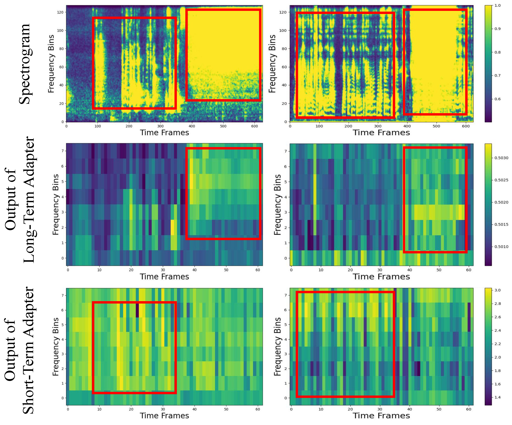

# MTDA-HSED [](https://arxiv.org/abs/2401.04976)
The official implementation of *MTDA-HSED:  Mutual-Assistance Tuning and Dual-Branch Aggregating for Heterogeneous Sound Event Detection.* (Submiited to ICASSP 2025)<br>Authors: Zehao Wang, Haobo Yue, Zhicheng Zhang, Da Mu, Jin Tang,Jianqin Yin


[Issues :blush:](https://github.com/Visitor-W) **|** [Lab :clap:](https://github.com/BUPT-COST-lab) **|** [Contact :mailbox:](wzhao@bupt.edu.cn)  

## Updating
Code will be released soon!

## Introduction

### Visualization of the M3A Module
<div align="center">

</div>
By comparing the feature maps of the long-term, short-term audio adapter with the spectrograms of the input data, we can see that most of the time-frequency patterns modeled by short-term audio adapter are temporally isolated and disjoint. In contrast, the long-term audio adapter's patterns and their neighbors are in a whole, thereby forming a special time-frequency representation.


### Visualization of the DBMF Module
<div align="center">

</div>
We compare the aggregated feature map using the DBMF module with the feature map of the baseline, we can see that the feature map of the baseline is blurred, as shown in the second row of the figure. After aggregating the local and global feature, the information within the DBMF feature map is more prominent, as shown in the third row of the figure.


## Performance
MTDA-HSED is evaluated on [DESED](https://github.com/turpaultn/DESED) and [Mestro](https://ieeexplore.ieee.org/document/10016759)

Model                   | PSDS1    $\uparrow$| PSDS1(sed score) $\uparrow$| mpAUC $\uparrow$
:----------------------:|:------------------:|:--------------------------:|:----------------:
Baseline                | 0.370              | 0.579                      | 0.469            
ATST-SED                | 0.370              | 0.579                      | 0.469            
MONA                    | 0.387              | 0.624                      | 0.467            
ADAPTER                 | 0.395              | 0.651                      | 0.495                       
ACT-NET                 | 0.431              | 0.663                      | 0.521            
M3A(ours)               | <ins>0.503<ins>    | <ins>0.511</ins>           | <ins>0.753<ins>       
DBMF(ours)              | 0.494              | 0.501                      | 0.748    
MTDA-HSED(yours)         | **0.503**          | **0.514**                  | **0.757**

## Reference
Our code is implemented based on [BEATs-CRNN](https://github.com/DCASE-REPO/DESED_task/tree/master/recipes/dcase2024_task4_baseline).<br>Specifically, experimental environment is based on [BEATs-CRNN](https://github.com/DCASE-REPO/DESED_task/tree/master/recipes/dcase2024_task4_baseline)<br>Thanks for their great work!


## Citation
If this repository helped your works, please cite papers below! :kissing_heart:
<!-- ```bib
@article{yue2024fullfrequency,
      title={Full-frequency dynamic convolution: a physical frequency-dependent convolution for sound event detection}, 
      author={Haobo Yue and Zhicheng Zhang and Da Mu and Yonghao Dang and Jianqin Yin and Jin Tang},
      journal={arXiv preprint arXiv:2401.04976},
      year={2024},
}
``` -->
